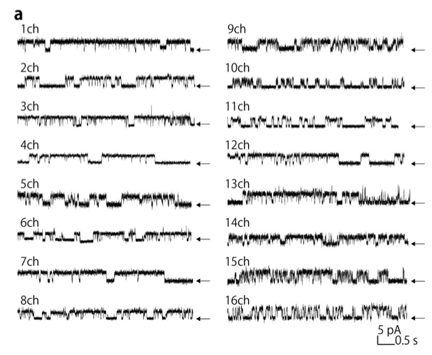

## Math 300Z: In-class group activity

## Membrane channels

Electrical signaling is one of the means of cell-to-cell communication in organisms. Familiar examples are nerve cells and muscle cells. The electrical activity is mediated by assemblies of a few proteins---called "membrane channels"---that penetrate the cell membrane and switch minute flows of electrical current on and off depending on conditions in the cell and the influence of neighboring cells.

Amazingly, even though this activity involves only thousands of atoms, it is possible to record the on-again-off-again activity of a single channel. (The 1991 Nobel Prize in Physiology or Medicine was awarded to E. Neher and B. Sakmann for their invention of the measurement technique, which is now widely used in electrophysiology research.)

The figure shows 16 recordings of the activity of different channels. Each of the recordings is a combination of signal and noise. 

TASK: In three recordings of your choice, 

1. Identify the signal by drawing it over the recording.
2. Measure the typical amplitude of the noise. For this purpose, use the guide at the lower-right corner of the figure: a short vertical line marks the amplitude of 5 pA, that is, 5 pico-Amps. 

To identify the signal, you need to know something about what the signal looks like. In our work in Math 300Z, the "signal" corresponds to a relationship between two variables or more. Here, one of the variables is *time*, the other is electrical *current*. Usually in Math 300Z we will be interested in "linear" relationships between the variables and we seek to identify the signal using only that limited piece of information. To define the signal in the single-channel recordings, use this information: the channels open and close to current, occasionally staying open (or closed) for the better part of a second, but also opening (or closing) for a much shorter time, say 0.01 second.

```{r echo=FALSE, out.width="100%"}

```


Source of image: Kawano, R., Tsuji, Y., Sato, K. et al. (2013) "Automated Parallel Recordings of Topologically Identified Single Ion Channels". *Scienfic Reports* **3(#1995) <https://doi.org/10.1038/srep01995>

