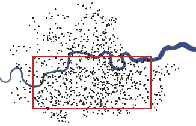
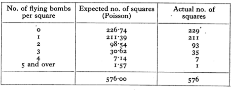

## Math 300Z: In-class group activity

Measurements are a combination of signal and noise. This activity aims to help understand how much data is needed to reduce the noise to an acceptable level.

### Background

Often, measurements are made of *how many* random events of a particular type happen in a fixed interval of time or a given area of space. Examples:

- *How many* inches of snow fall per year in a given location?
- *How many* traffic accidents happen per year at a particular intersection?

Making such measurements can be straightforward. The challenge comes in interpreting them. For instance, how different do the measurements of snowfall in two different areas need to be to support a claim that one area is snowier than the other? Similarly, how many years of observation are required to know if one intersection is more dangerous than another?

Common sense tells us that one region can be snowier than another or that one intersection can be more dangerous than another. Yet the individual events---a snow storm of a given magnitude or a pedestrian hit by an automobile---are random. That is, there is both *signal* and *noise* in the measurements.

This activity is about how much data we should collect in order to reduce the noise sufficiently that signals can be read clearly.

### Process

1. Each of the people in your group will create his or her own *signal*, that is, a single number specifying the rate at which events happen. 

- Do not look at your *signal* until directed to.
- Generate your *signal* with this command:

```{r results="hide"}
signal <- 50*(5 + runif(1)) # Don't peek
```

Once all of your group members have their own signal, you are going to start to generate noisy data. The idea is to compare the observations you make to those from the other group members to decide the extent to which the signals differ from one another.

2. Generate a single ($n=1$) measurement this way: 

```{r results="hide"}
rpois(n=1, lambda=signal)
```

Compare your measurement to those of *each* of the other members of the group. For each of those members, decide among these choices, making sure not to look at the numerical value of `signal`.

i. My signal is certainly higher.
#. My signal is likely to be higher.
#. Can't tell whether my signal is different than the other person's.
#. My signal is likely to be lower.
#. My signal is certainly lower.
    
Record your conclusion for each of your group partners.

3. Repeat the process in (2), but generate $n=2$ observations. You will have two numbers, which you will compare to the other person's two numbers. You'll have to decide how you want to do this. 

Make a note of the method you choose do the comparison and record your conclusion (i)-(v) for each of your group partners.

4. Repeat (3), but this time with $n=4$.

Are you still happy with the method you chose in (3)? If not, figure out a new method that can handle the comparison of 4 numbers to another set of 4 numbers.

Once again, record your conclusion (i)-(v) of your data against each of your group partners.

5. Repeat the following for each of your partners separately. Try higher values of $n$ until the two of you agree that your signals are *certainly* different.

### Deep background (for later reading)

Starting in June 1944, the Germans engaged in missile attacks against London. At first, the V-1 cruise missile was used. Later, the V-2 ballistic missile was added to the attack.

The London City Council kept records of V-1 impact sites within their jurisdiction. @fig-v1-hits shows the locations.

```{r echo=FALSE}
#| label: fig-v1-hits
#| fig-cap: "Map showing impact sites of V-1 missiles in the area administered by the London City Council. The Thames river is shown in blue. The map does not show impacts outside the LCC region."
#| fig-cap-location: margin
#| out-width: "40%"
#| fig-align: "center"

```

An [analysis published in 1946](https://www.jstor.org/stable/41138751) looked at 537 V-1 impacts within the area outlined in red: a region of 144 km^2^. The area was divided into 576 boxes each of area 0.25 km^2^. Five-hundred thirty-seven V-1 impacts fell within the rectangle; suggesting that there might be about 1 impact per box. 

To be more precise, the *signal* is 537 / 576 = 0.93 impact per box.

There is a mathematical theory of how the measured number of impacts will vary from one box to another. The theory is called the **Poisson distribution**. In the activity, when you used `rpois(n=1, lambda=signal)` the computer was using this theory to generate the measurement, that is, signal plus noise.

These are the results of comparing the theory to the actual observations of how many boxes had no impact, 1 impact, 2 impacts, and so on.

```{r echo=FALSE}
#| label: fig-v1-counts
#| fig-cap: "The number of boxes (out of 576, total) with different numbers of impacts. The Poisson theory result is in the middle column. (Copied from the [1946 analysis paper](https://www.jstor.org/stable/41138751)."
#| fig-cap-location: margin
#| out-width: "75%"
#| fig-align: "center"

```

[This article](https://rss.onlinelibrary.wiley.com/doi/pdf/10.1111/j.1740-9713.2019.01315.x) gives a more detailed account.


